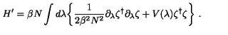
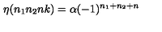

# Qwen2-VL LaTeX OCR

This project fine-tunes Qwen2-VL-2B-Instruct on the `unsloth/LaTeX_OCR` dataset to convert images of mathematical equations into LaTeX.

Status: complete. After 100 LoRA fine-tuning steps, the adapter gives cleaner direct LaTeX responses than the base model; it closely reproduces the long expression in sample 03 and exactly matches sample 05. The remaining samples show that further training would still improve symbol-level accuracy. See [the full comparison table](results/comparisons.md).

## How to reproduce

1. Clone this repository.
2. Open `notebooks/colab_train.ipynb` in Google Colab and select a GPU runtime (a free T4 works).
3. Choose **Run all**. The notebook exports demo images, fine-tunes the adapter, evaluates it, and downloads both the adapter archive and `comparisons.md`.

## Examples

### Sample 03

Ground truth: `H ^ { \prime } = \beta N \int d \lambda \biggl \{ \frac { 1 } { 2 \beta ^ { 2 } N ^ { 2 } } \partial _ { \lambda } \zeta ^ { \dagger } \partial _ { \lambda } \zeta + V ( \lambda ) \zeta ^ { \dagger } \zeta \biggr \} \ .`

Fine-tuned prediction: `H ^ { \prime } = \beta N \int d \lambda \left\{ \frac { 1 } { 2 \beta ^ { 2 } N ^ { 2 } } \partial _ { \lambda } \zeta ^ { \dagger } \partial _ { \lambda } \zeta + V ( \lambda ) \zeta ^ { \dagger } \zeta \right\} .`

### Sample 05

Ground truth: `\eta ( n _ { 1 } n _ { 2 } n k ) = \alpha ( - 1 ) ^ { n _ { 1 } + n _ { 2 } + n }`

Fine-tuned prediction: `\eta ( n _ { 1 } n _ { 2 } n k ) = \alpha ( - 1 ) ^ { n _ { 1 } + n _ { 2 } + n }`

## Credits

- Dataset: [unsloth/LaTeX_OCR](https://huggingface.co/datasets/unsloth/LaTeX_OCR)
- Fine-tuning library: [Unsloth](https://github.com/unslothai/unsloth)
